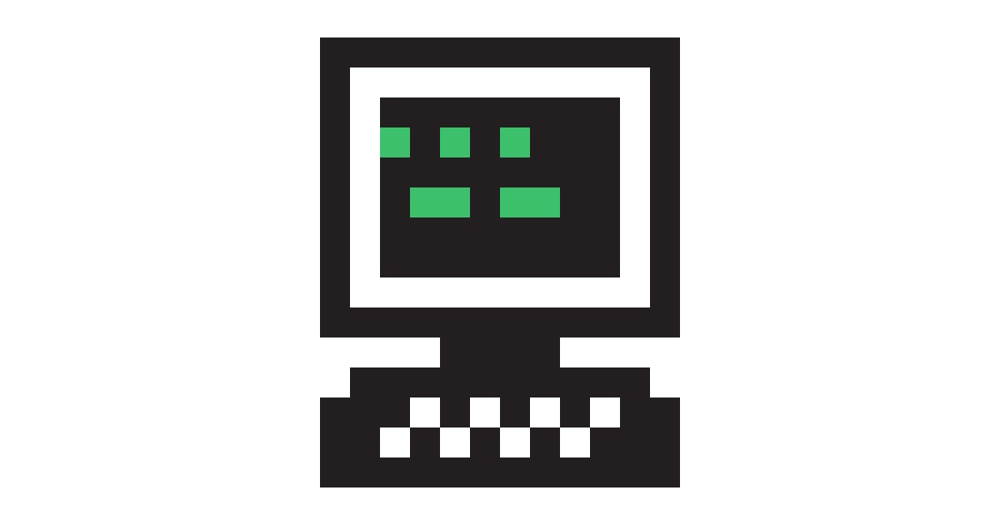

I completed a 12-week batch at the Recurse Center (RC) last Fall (August-Nov 2025). After getting asked a handful of times about my experience at RC, I'm finally getting around to writing my "return statement" which is what the RC community calls our retrospectives on the experience.

*What is the Recurse Center (RC)?*

> The Recurse Center is the retreat where curious programmers recharge and grow. It's an opportunity to dedicate your time to programming in a focused, supportive, and energizing environment. It's a chance to build and learn new things, to meet and work with kindred spirits, and to accelerate or change the trajectory of your career and life.
>
> — [Recurse Center](https://www.recurse.com)

RC has three guiding principles, often referred to as "self-directives":

* Work at the edge of your abilities
* Build your volitional muscles
* Learn generously

Participants can join the batches in person in a two-floor Brooklyn hub or remotely from anywhere in the world as long as they can commit to a 11am - 5pm ET daily working window. RC also offers optional recruiting services that match Recursers to partner companies who pay RC a commission. This recruiting business keeps RC free for all participants.

*Why did I do RC?*

I had planned to take a career break to study Mandarin Chinese in Taiwan. As I was planning my break, one of my programmer friends told me about RC as something I could consider upon returning to NY. Thankfully, I wrote down a reminder to apply to RC upon returning from my language studies, and applied to RC for the Fall 1 2025 batch, and am so glad I got in!

*My time at RC*

My time at RC not only helped me get back into programming and discover current tech trends, but also gave me a sense of community that I needed upon returning from abroad. I did my 12-week batch in person at the Brooklyn Hub, and would recommend doing RC in-person if possible.

The first week of RC was overwhelming for me, and I've learned that this is a common experience. Not only was I rusty as a programmer, I was also out of touch with the new jargon of the day such as "agentic" and "MCP". Fortunately, my batchmates were patient in teaching me concepts I had never heard of. One serendipitous RC friend I made in my first week, Sarah Tan, actually had spent years working in the field of machine learning and artificial intelligence. We started pairing on an AI project related to Chinese idioms to help me get familiar with AI engineering. Sarah and I paired many times on the project in my first couple weeks, and it eventually became the main focus of my 12 week batch. This project idea was completely serendipitous. I wrote a full blog on this [Chinese Idiom Finder](/blog/idiomfinder/) project. While working on a problem space related to my Chinese language studies, I also got hands-on experience working with LLM APIs, starting up a MCP server, and testing agentic workflows.

Besides working on my main project, I also enjoyed the following activities:

* Learning about others' projects in the weekly Thursday presentations
* Having ad-hoc coffee chats with batchmates to learn about their career paths
* Pairing sessions to learn about batchmates' projects
* Discussing how folks were learning AI coding tools, and then pairing with batchmates on getting started with Claude Code and Cursor
* Fun conversations at the Hub dining table and kitchen area

*Final thoughts*

I am grateful for my time at RC as it was a grounding space and community when I needed it. Friends have asked about my experience and whether they would suggest it. I completed my batch during a time when I was already on a career break, and needed a push to get back into programming and job search mode. I think everyone's needs are different, but RC is definitely a valuable space to find community with other curious programmers.
